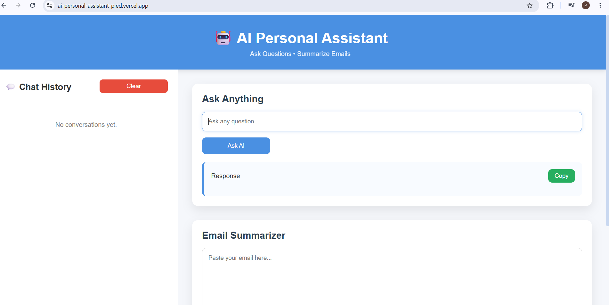
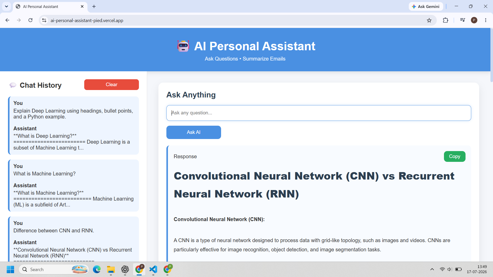
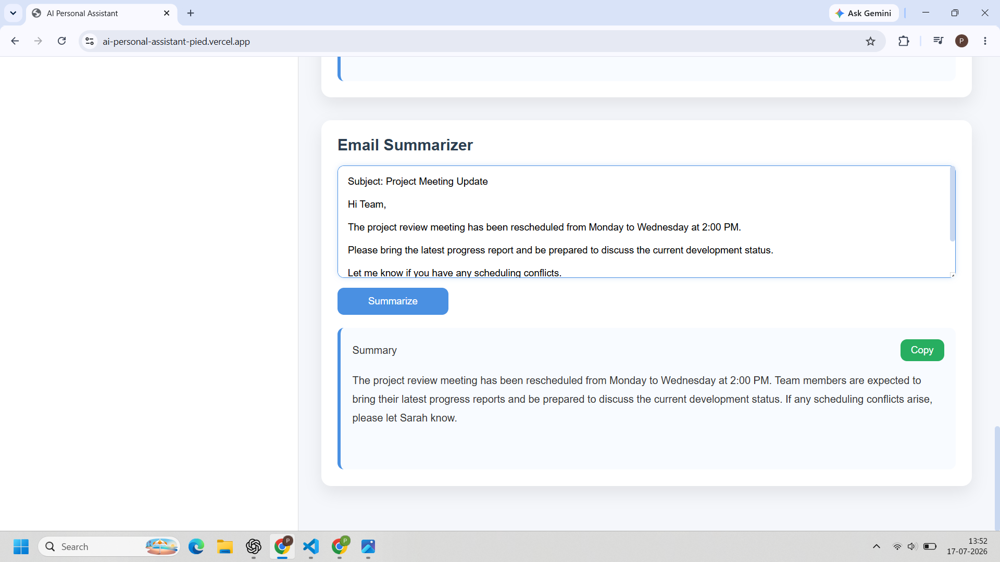

# 🤖 AI Personal Assistant

An AI-powered Personal Assistant built with **Flask** and **Groq API** that provides conversational AI, email summarization, markdown-rendered responses, and chat history through a clean and responsive web interface.

## 🌐 Live Demo

🔗 **Application:** https://ai-personal-assistant-pied.vercel.app/

## 📂 GitHub Repository

🔗 https://github.com/praveena-pawar/AI-Personal-Assistant.git

---

# 📖 Project Overview

AI Personal Assistant is a web application that allows users to interact with an AI assistant in real time. It supports conversational AI, email summarization, markdown rendering for well-formatted responses, and maintains chat history during the session.

The application is designed with a simple and intuitive interface while demonstrating backend API integration, prompt handling, and modern web development practices.

---

# ✨ Features

- 💬 AI-powered conversational assistant
- 📧 Email summarization
- 📝 Markdown-rendered AI responses
- 📜 Session-based chat history
- 📋 Copy AI response
- 📋 Copy email summary
- 🗑️ Clear conversation history
- ⚡ Loading spinner for better user experience
- 📱 Responsive user interface
- 🔒 Secure API key management using environment variables

---

# 🛠️ Tech Stack

### Backend

- Python
- Flask
- Groq API
- python-dotenv

### Frontend

- HTML5
- CSS3
- JavaScript
- Marked.js

### Deployment

- Vercel

### Version Control

- Git
- GitHub

---

# 📂 Project Structure

```text
AI-Personal-Assistant/
│── static/
│   ├── style.css
│   └── script.js
│
│── templates/
│   └── index.html
│
│── main.py
│── requirements.txt
│── .gitignore
│── .env.example
│── vercel.json
│── README.md
```

---

# ⚙️ Installation

Clone the repository

```bash
git clone https://github.com/praveena-pawar/AI-Personal-Assistant.git
```

Navigate into the project

```bash
cd AI-Personal-Assistant
```

Create a virtual environment

```bash
python -m venv .venv
```

Activate the environment

Windows

```bash
.venv\Scripts\activate
```

Linux / macOS

```bash
source .venv/bin/activate
```

Install dependencies

```bash
pip install -r requirements.txt
```

---

# 🔑 Environment Variables

Create a `.env` file in the project root.

```env
GROQ_API_KEY=your_groq_api_key
```

---

# ▶️ Run the Application

```bash
python main.py
```

Open your browser and visit

```
http://127.0.0.1:5000
```

---

# 📸 Screenshots

## Home Page



---

## AI Assistant



---

## Email Summarizer



---

# 🚀 Future Improvements

- Persistent chat history using a database
- User authentication
- Multiple AI model selection
- Export conversations
- Conversation search
- Theme customization
- Voice input and speech output

---

# 📚 What I Learned

This project helped me strengthen my understanding of:

- Flask web development
- REST API integration
- Prompt engineering fundamentals
- Environment variable management
- Frontend and backend communication
- JavaScript Fetch API
- Responsive UI development
- Git and GitHub workflow
- Cloud deployment using Vercel

---

# 👨‍💻 Author

**Praveena**

GitHub: https://github.com/praveena-pawar

---

## ⭐ If you found this project useful, consider giving it a star.
